# ACIT4610-24H-G13
ACIT4610-G13

# Introduction
This project aims to implement, and study the application of algorithms/techniques for evolutionary AI.

# Project Environment
1. Python 3
2. OpenAI
3. Gym for the environment
4. Deep to use Genetic Programming, and implement an evolutionary algorithms.
5. NumPy for numerical computations.
6. Pandas for data manipulation and analysis.
7. Requests for the process of sending and receiving data from websites.
8. Matplotlib for plotting results.
9. TensorFlow/PyTorch for more advanced RL algorithms like DQN.
10.Pymoo for for multi-objective optimization algorithms.

# The project contain many tasks.

# Task 1. Traffic Management Optimization Using Multi-Objective Evolutionary Algorithms.

 Is to apply a Multi-Objective Evolutionary Algorithm (MOEA) to optimize traffic management strategies for selected New York City (NYC) areas. The goal is to minimize conflicting objectives, Total Travel Time (TTT) and Fuel Consumption (FC), using real-world traffic data from NYC Open Data.

# Data source: 
1. NYC Traffic Volume Counts (2014-2022): NYC Open Data - Traffic Volume
(https://data.cityofnewyork.us/Transportation/Traffic-Volume-Counts/btm5-
ppia/about_data)

2. Traffic Speed Data: NYC Open Data - Traffic Speed
(https://data.cityofnewyork.us/Transportation/DOT-Traffic-Speeds-NBE/i4gi-
tjb9/about_data)

# Results

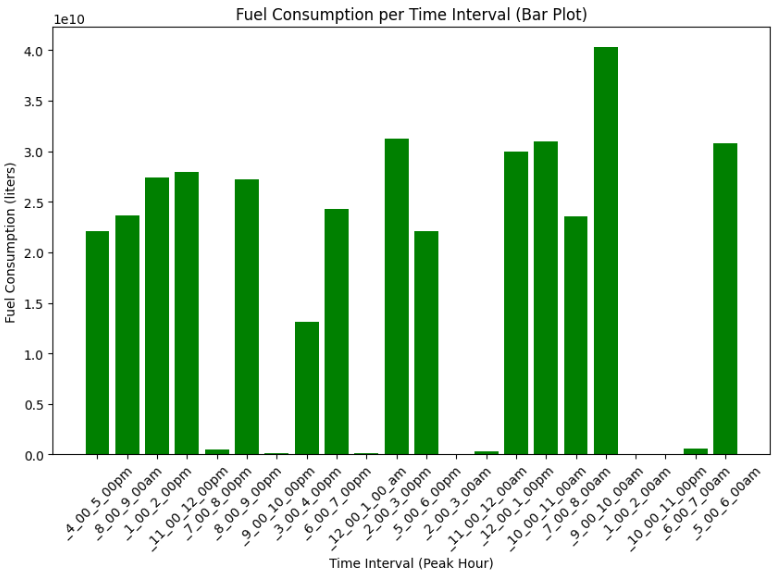
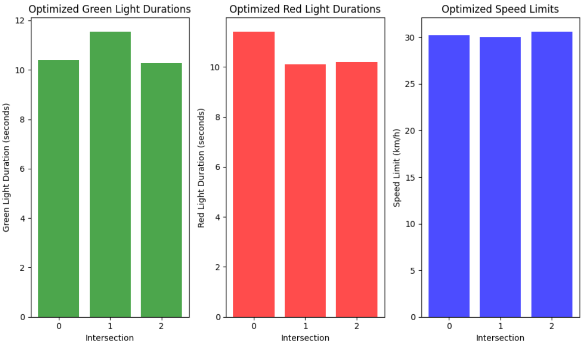

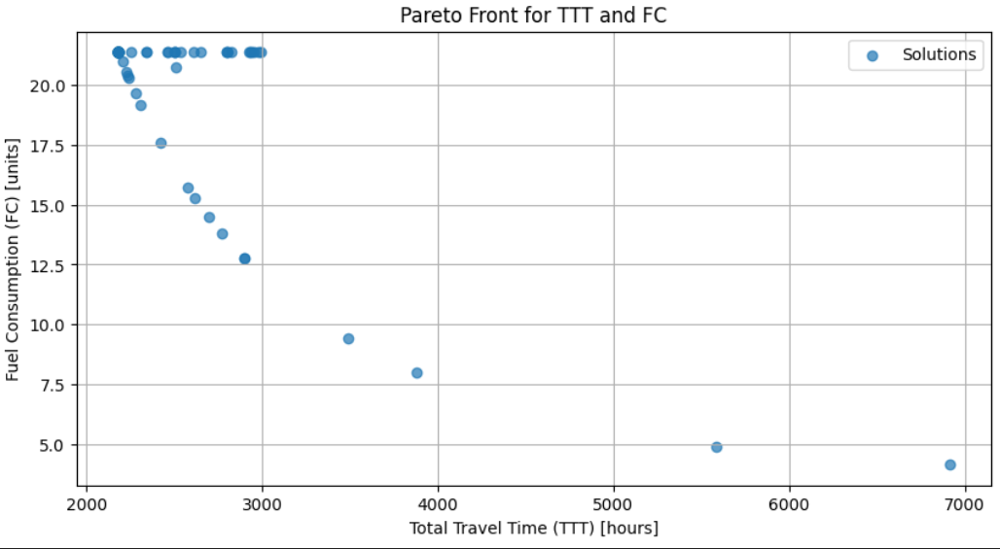
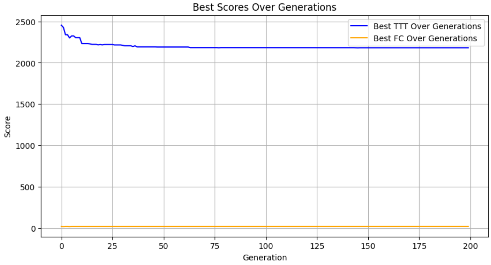

# Task 2
To find the code, you have to navigate to the folder task-2, and inside that one locate stock.py. The file task-2 in the main folder is empty and the task-2 file in the task-2 folder is obsolete, so navigate to stock.py

task-2\task-2.py(obsolete):
 This Python code snippet uses the yfinance library to download historical stock price data and compute the monthly returns for a list of specified stock tickers. It begins by importing the necessary libraries: yfinance for financial data retrieval and pandas for data manipulation. A list of stock tickers is defined, representing major technology and consumer companies. The code also establishes a date range for downloading the historical stock data, spanning from January 1, 2020, to January 1, 2023. This setup prepares the environment to analyze the stock performance over a defined period.
 The main functionality is encapsulated in a loop that iterates over each stock ticker in the list. Within the loop, the yf.download() function fetches the historical daily stock prices from Yahoo Finance. The daily stock prices are then resampled to calculate monthly returns, which are computed by using the percentage change of the adjusted closing prices. The monthly returns are stored in a new DataFrame, which is constructed iteratively. If the monthly_returns_combined DataFrame is empty, it initializes it with the returns of the first ticker. For subsequent tickers, it joins their monthly returns to the existing DataFrame, ensuring that all stock returns are consolidated into a single DataFrame for further analysis.
 After calculating the monthly returns for all tickers, the code drops any rows containing missing values that might have resulted from stocks that did not have data for certain months. It then computes the covariance matrix of the monthly returns using the cov() method from pandas, which reveals the relationship between the returns of the different stocks. Finally, the covariance matrix is printed to the console, providing insights into how the stock returns move in relation to each other, which is particularly useful for portfolio optimization and risk assessment in financial analyses.
# Task 3. Solving the Vehicle Routing Problem with Time Windows (VRPTW) Using Ant Colony Optimization (ACO) and Particle Swarm Optimization (PSO) 

 This task focuses on optimizing the delivery routes for a fleet of vehicles using two nature
inspired optimization algorithms: Ant Colony Optimization (ACO) and Particle Swarm 
Optimization (PSO). The objective is to find the most efficient routes for a set of vehicles, 
ensuring that all customers receive their deliveries within specified time windows. You will 
implement both ACO and PSO to solve the Vehicle Routing Problem with Time Windows 
(VRPTW) and compare the effectiveness of these algorithms.

# Data source: 
1. Solomon Benchmark website.  the C101.txt dataset.
(http://web.cba.neu.edu/~msolomon/c101.htm)

# Results
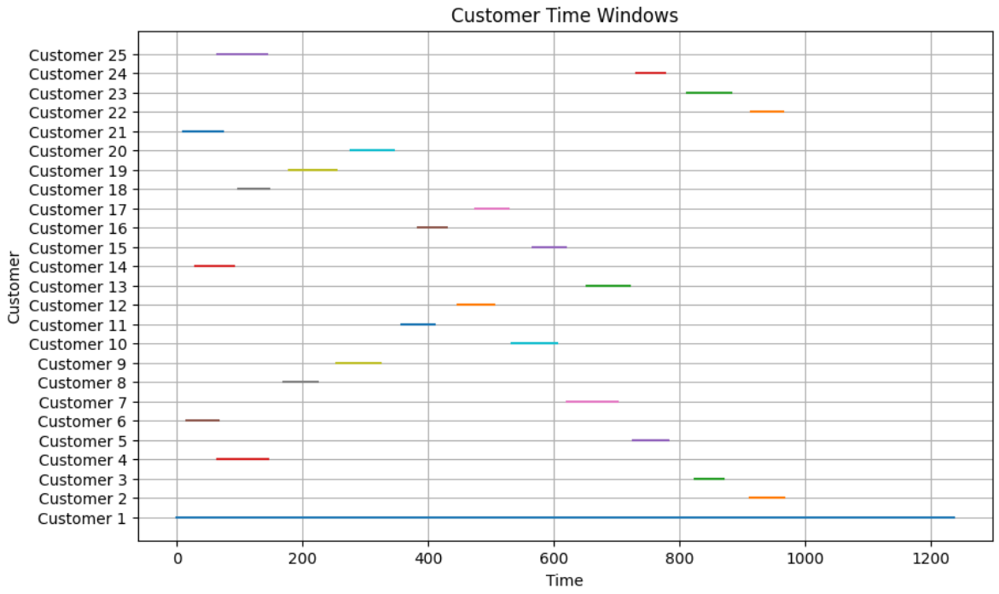

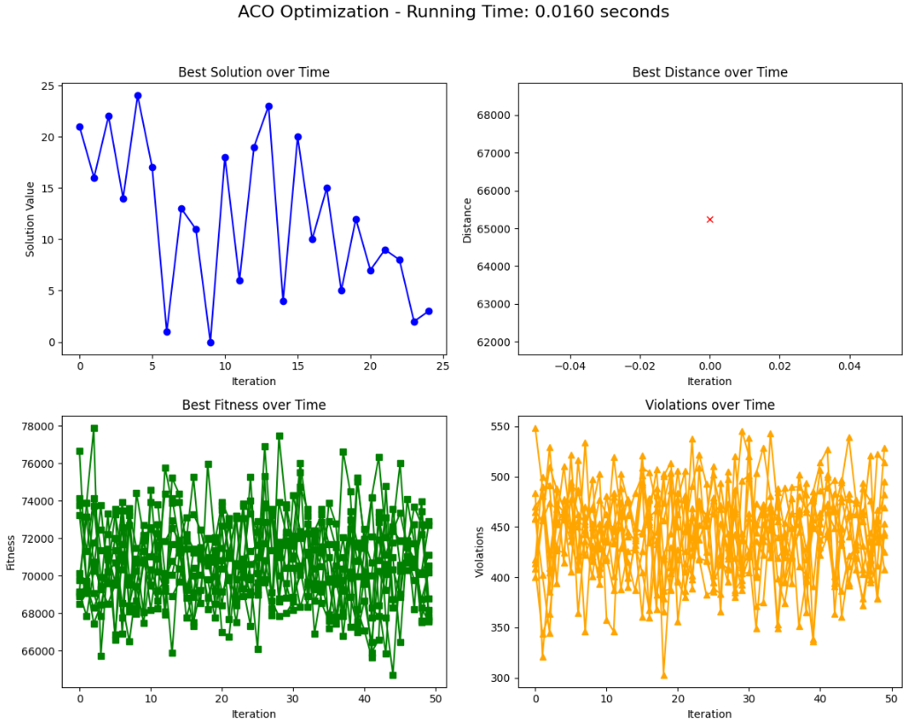

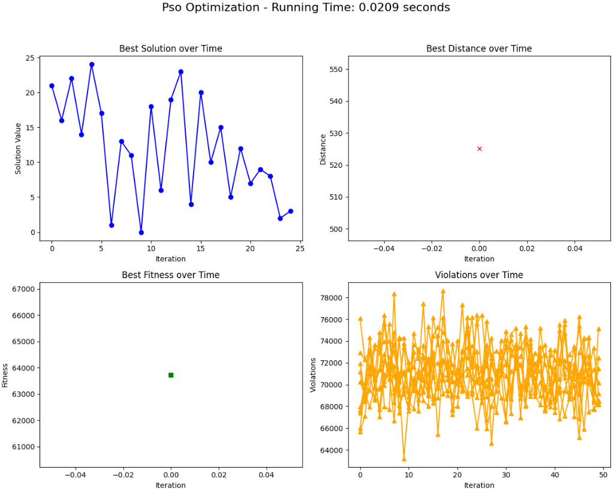

In adithon, the best distance achieved by ACO is 65,254.61, while the best distance achieved by PSO is 525.22. This indicates that the ACO algorithm has a higher value for the distance metric.

Moreover, The best solution (path) obtained by the ACO algorithm is:
[21, 16, 22, 14, 24, 17, 1, 13, 11, 0, 18, 6, 19, 23, 4, 20, 10, 15, 5, 12, 7, 9, 8, 2, 3].

On the other hand, the best solution (path) obtained by the PSO algorithm is:
[17, 0, 16, 20, 15, 3, 12, 2, 19, 22, 1, 24, 9, 18, 8, 13, 4, 7, 11, 21, 23, 5, 10, 6, 14].

Overall, both ACO and PSO provide valid solutions, but they may represent different trade-offs in optimization based on their respective mechanisms.

# Task 4. Solving a Real-World Problem Using Reinforcement Learning.

 Is to apply reinforcement learning techniques to solve a real-world problem. Students used a publicly available dataset to train an RL agent, evaluated its performance, and optimized it to achieve the best possible outcome.

# Data source: 
The exercise will utilize the Taxi-v3 environment available in the OpenAI Gym repository. 
This environment simulates a simplified grid world where an agent must pick up and drop off 
passengers at the correct locations while avoiding walls and other obstacles. 
• Link to Dataset/Environment: Taxi-v3 on OpenAI Gym.

# Environment Description: 
• Grid Size: 5x5 grid. 
• Taxi: The agent (taxi) starts at a random location. 
• Passenger: A passenger is located at one of the grid cells and has a target destination. 
• Actions: The taxi can move North, South, East, West, Pick-up, or Drop-off. 
• Rewards: The taxi receives a reward for successfully dropping off the passenger and a 
penalty for every wrong action or delay. 

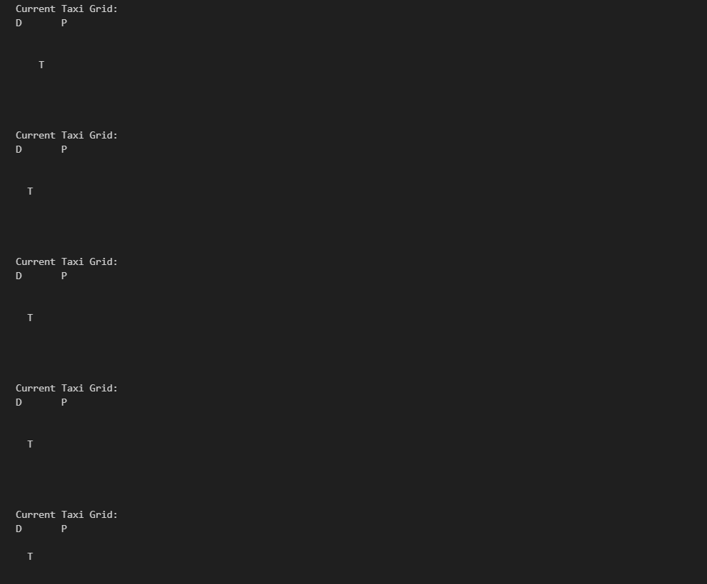
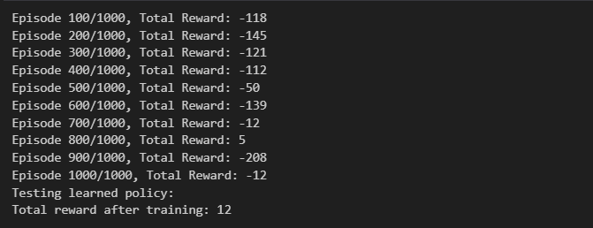
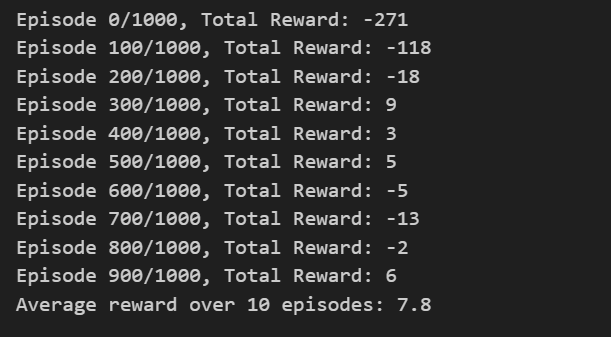
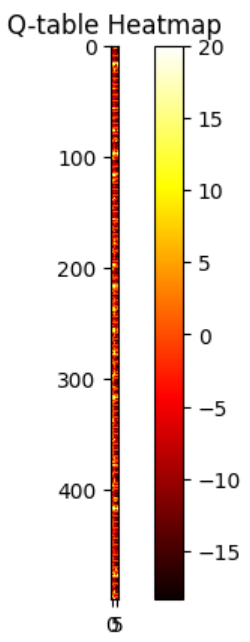
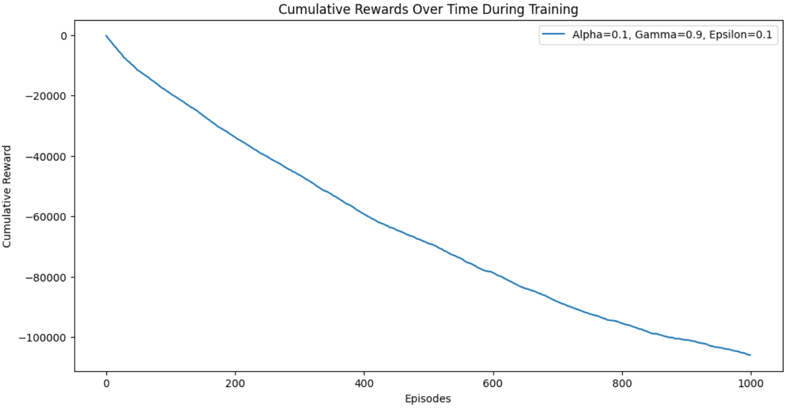

