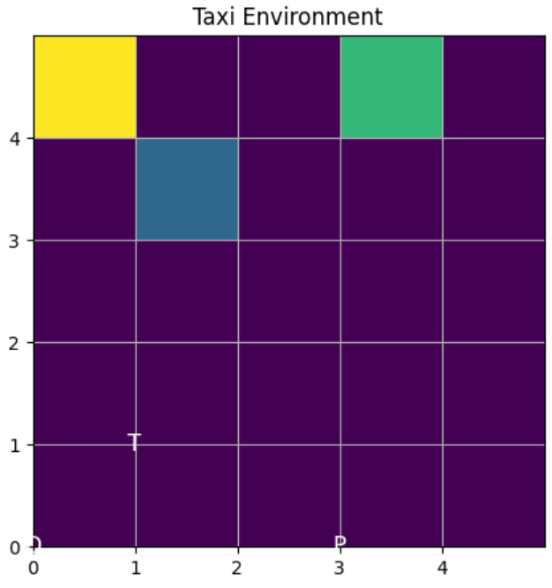

# ACIT4610-24H-G13
ACIT4610-G13

# Introduction
This project aims to implement, and study the application of algorithms/techniques for evolutionary AI.

# Project Environment
1. Python 3
2. OpenAI
3. Gym for the environment
4. Deep to use Genetic Programming, and implement an evolutionary algorithms.
5. NumPy for numerical computations.
6. Pandas for data manipulation and analysis.
7. Requests for the process of sending and receiving data from websites.
8. Matplotlib for plotting results.
9. TensorFlow/PyTorch for more advanced RL algorithms like DQN.
10.Pymoo for for multi-objective optimization algorithms.

# The project contain many tasks.

# Task 1. Traffic Management Optimization Using Multi-Objective Evolutionary Algorithms.

 Is to apply a Multi-Objective Evolutionary Algorithm (MOEA) to optimize traffic management strategies for selected New York City (NYC) areas. The goal is to minimize conflicting objectives, Total Travel Time (TTT) and Fuel Consumption (FC), using real-world traffic data from NYC Open Data.

# Data source: 
1. NYC Traffic Volume Counts (2014-2022): NYC Open Data - Traffic Volume
(https://data.cityofnewyork.us/Transportation/Traffic-Volume-Counts/btm5-
ppia/about_data)

2. Traffic Speed Data: NYC Open Data - Traffic Speed
(https://data.cityofnewyork.us/Transportation/DOT-Traffic-Speeds-NBE/i4gi-
tjb9/about_data)

# Results

# Task 2
Evolutionary Portfolio Optimization
Overview
This project explores six versions of evolutionary algorithms to optimize stock portfolios, focusing on maximizing the Sharpe ratio. It evaluates 20 stocks (2018–2022) using advanced methodologies like Evolutionary Programming (EP) and Evolutionary Strategies (ES).

Methodology
Version 1 & 2: Evolutionary Programming (EP)

V1: Basic mutation-based algorithm.
V2: Advanced with self-adaptive mutation, elitism, and fitness-proportional selection.
Version 3 & 4: Evolutionary Strategies (ES)

V3: Basic Gaussian mutation and top-candidate selection.
V4: Advanced with self-adaptive mutation rates and recombination.
Version 5 & 6: ES with μ + λ and μ, λ

V5: Combines parents (μ) and offspring (λ) for selection.
V6: Selects only the top μ offspring for the next generation.
Results
Best Performers: Versions 2, 3, and 4 showed high stability, smooth convergence, and consistent improvement.
Weaker Performers: Versions 5 and 6 had higher variability and less reliable results.
Future Improvements
Fine-tuning parameters (e.g., mutation rates, population size).
Adding constraints (e.g., asset weights, sector limits).
Expanding datasets (e.g., international stocks, different periods).
Combining EP/ES with other algorithms (e.g., genetic algorithms, particle swarm optimization).
Exploring alternative metrics (e.g., Sortino ratio, CVaR).
Figures
The report includes:

Covariance matrix.
Average and cumulative returns.
Algorithm performance metrics (Consistency, Convergence, Expected Return).

# Task 3. Solving the Vehicle Routing Problem with Time Windows (VRPTW) Using Ant Colony Optimization (ACO) and Particle Swarm Optimization (PSO) 

 This task focuses on optimizing the delivery routes for a fleet of vehicles using two nature
inspired optimization algorithms: Ant Colony Optimization (ACO) and Particle Swarm 
Optimization (PSO). The objective is to find the most efficient routes for a set of vehicles, 
ensuring that all customers receive their deliveries within specified time windows. You will 
implement both ACO and PSO to solve the Vehicle Routing Problem with Time Windows 
(VRPTW) and compare the effectiveness of these algorithms.

# Data source: 
1. Solomon Benchmark website.  the C101.txt dataset.
(http://web.cba.neu.edu/~msolomon/c101.htm)

# Results

In adithon, the best distance achieved by ACO is 65,254.61, while the best distance achieved by PSO is 525.22. This indicates that the ACO algorithm has a higher value for the distance metric.

Moreover, The best solution (path) obtained by the ACO algorithm is:
[21, 16, 22, 14, 24, 17, 1, 13, 11, 0, 18, 6, 19, 23, 4, 20, 10, 15, 5, 12, 7, 9, 8, 2, 3].

On the other hand, the best solution (path) obtained by the PSO algorithm is:
[17, 0, 16, 20, 15, 3, 12, 2, 19, 22, 1, 24, 9, 18, 8, 13, 4, 7, 11, 21, 23, 5, 10, 6, 14].

Overall, both ACO and PSO provide valid solutions, but they may represent different trade-offs in optimization based on their respective mechanisms.

# Task 4. Solving a Real-World Problem Using Reinforcement Learning.

 Is to apply reinforcement learning techniques to solve a real-world problem. Students used a publicly available dataset to train an RL agent, evaluated its performance, and optimized it to achieve the best possible outcome.

# Data source: 
The exercise will utilize the Taxi-v3 environment available in the OpenAI Gym repository. 
This environment simulates a simplified grid world where an agent must pick up and drop off 
passengers at the correct locations while avoiding walls and other obstacles. 
• Link to Dataset/Environment: Taxi-v3 on OpenAI Gym.

# Environment Description: 
• Grid Size: 5x5 grid. 
• Taxi: The agent (taxi) starts at a random location. 
• Passenger: A passenger is located at one of the grid cells and has a target destination. 
• Actions: The taxi can move North, South, East, West, Pick-up, or Drop-off. 
• Rewards: The taxi receives a reward for successfully dropping off the passenger and a 
penalty for every wrong action or delay. 

